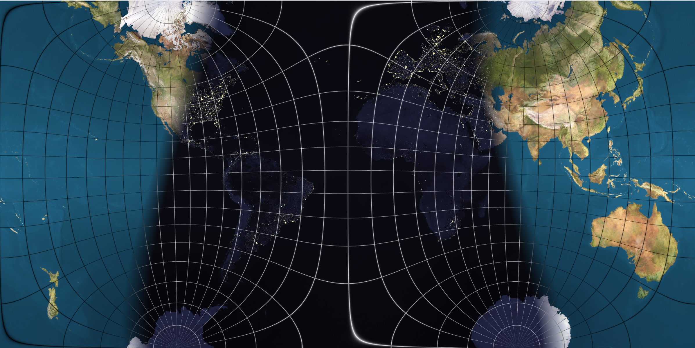
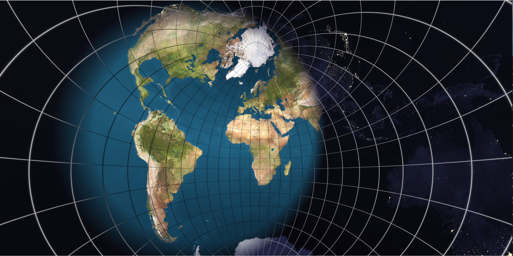

# Earth Projection

A real-time demo of different map projections using OpenCL. Combines multiple textures of the earth's surface to simulate a day-night cycle.
The earth is rotated based on the mouse position in the display window.

### Examples

